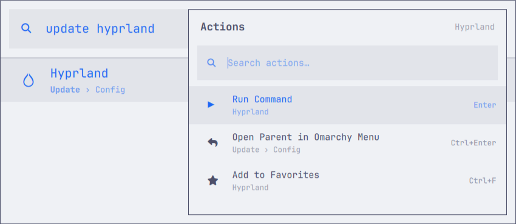

# Omalauncher

Omalauncher is a keyboard-first command palette for Omarchy 4. It searches
installed applications and flattens the stock JSONC menu into a unified index,
while keeping each command's ancestor path as context.



The current implementation includes:

- Installed applications from Omarchy's shared application library
- A `DesktopEntries` fallback isolated behind the application adapter
- Application names, generic names, comments, keywords, categories, and IDs
- Stock and user menu JSONC parsing with hot reload
- Per-field user overrides
- Breadcrumb-aware command records
- One batched `when`/`checked` visibility process
- Deterministic semantic ranking
- Persistent favorites and usage history
- Frecency as a tie-breaker within equal semantic matches
- Favorites and recent applications/commands before typing
- A searchable, context-aware Action Panel
- A minimal focused Quickshell menu surface
- Native application icons and launch feedback
- Delegated execution through `omarchy menu summon <route>`

Press `Ctrl+F` on the selected row to add or remove a favorite. Selecting a
result updates its usage history; stronger semantic matches always remain
ahead of frecency. State is written atomically to:

```text
${XDG_STATE_HOME:-~/.local/state}/omalauncher/state.json
```

Press `Ctrl+K` to open the Action Panel for the selected result. Its actions
can be searched immediately and include:

- Run the command or open the application/menu
- Open a command's parent in the stock Omarchy menu
- Add or remove the result from Favorites
- Reset learned ranking when usage history exists

`Escape` closes the Action Panel first, then clears the root query, then
closes Omalauncher. `Ctrl+Enter` remains a direct shortcut for opening a
command's parent menu.

## Validate

```bash
npm run validate
npm run spike
```

The release check runs all Node tests, manifest validation, `qmllint`, and an
isolated clean install/remove cycle through the real Omarchy plugin CLI. Run
only the packaging smoke test with `npm run package:smoke`.

Use `npm run spike -- --all` to inspect static discovery without applying
`when` visibility. This is useful for proving paths for software that is not
currently installed.

## Install

Omalauncher is tested with Omarchy 4.0 and Quickshell 0.3. Install the private
repository through Omarchy after ensuring Git can authenticate to GitHub:

```bash
omarchy plugin add https://github.com/mirashif/omalauncher.git --enable --yes
```

Third-party Omarchy plugins live at:

```text
~/.config/omarchy/plugins/io.github.omalauncher/
```

For development, copy a local checkout there instead:

```bash
mkdir -p ~/.config/omarchy/plugins/io.github.omalauncher
rsync -a --exclude=.git --exclude=node_modules \
  ./ ~/.config/omarchy/plugins/io.github.omalauncher/
omarchy-shell shell rescanPlugins
omarchy plugin enable io.github.omalauncher
```

Then add this user binding to `~/.config/hypr/bindings.lua`:

```lua
o.bind(
  "SUPER + R",
  "Omalauncher",
  "omarchy-shell shell toggle io.github.omalauncher '{}'"
)
```

`SUPER + SPACE` and `SUPER + ALT + SPACE` remain owned by the stock Omarchy
menu. After changing the binding, validate Hyprland with:

```bash
hyprctl reload
hyprctl configerrors
```

Update a Git-managed installation with:

```bash
omarchy plugin update io.github.omalauncher --yes
```

## Roll back

For a Git-managed installation, select a known-good commit and restart only
the shell:

```bash
plugin_dir="$HOME/.config/omarchy/plugins/io.github.omalauncher"
git -C "$plugin_dir" log --oneline -10
git -C "$plugin_dir" checkout <commit>
omarchy restart shell
```

## Remove

Remove the `SUPER + R` stanza from `~/.config/hypr/bindings.lua`, validate the
configuration, then remove the plugin:

```bash
hyprctl reload
hyprctl configerrors
omarchy plugin disable io.github.omalauncher
omarchy plugin remove io.github.omalauncher
```

Favorites and usage history intentionally remain at the state path shown
above, so reinstalling preserves them. That directory can be deleted
separately if a complete data reset is desired. No packaged file below
`/usr/share/omarchy` is modified.

## Troubleshooting

Check that the plugin is loaded and both providers have settled:

```bash
omarchy-shell shell call io.github.omalauncher ping ''
omarchy-shell shell call io.github.omalauncher stats ''
```

If `SUPER + R` does nothing, verify the binding, reload Hyprland, and inspect
configuration errors:

```bash
rg -n 'SUPER.*R|io.github.omalauncher' ~/.config/hypr/bindings.lua
hyprctl reload
hyprctl configerrors
```

If the plugin was updated but the old keep-loaded instance remains, recreate
the shell process and inspect its recent log:

```bash
omarchy restart shell
qs log -p "$OMARCHY_PATH/shell" -t 100 | rg -i 'omalauncher|warning|error'
```

A malformed `~/.config/omarchy/extensions/omarchy-menu.jsonc` is reported in
the launcher and shell log while the last valid command index remains usable.
Commands whose `when` checks are false are intentionally absent. Use
`npm run spike -- --all` from a checkout to inspect static routes without
visibility filtering.

## License

Omalauncher is available under the [MIT License](LICENSE). It integrates with
the installed Omarchy shell and theme APIs but does not redistribute or modify
packaged files under `/usr/share/omarchy`.
