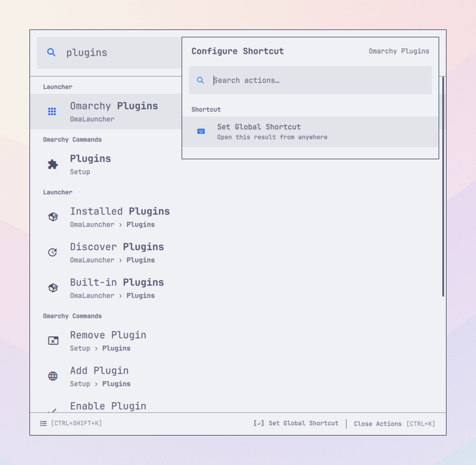
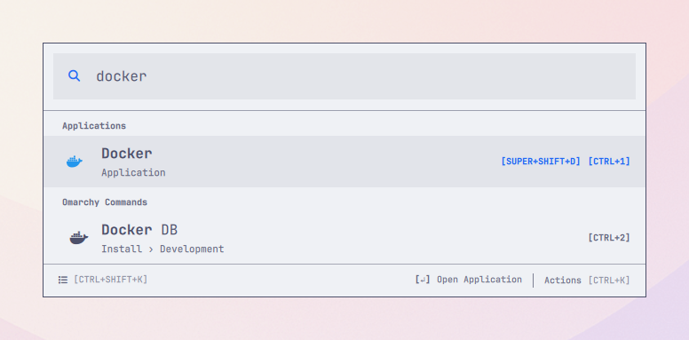
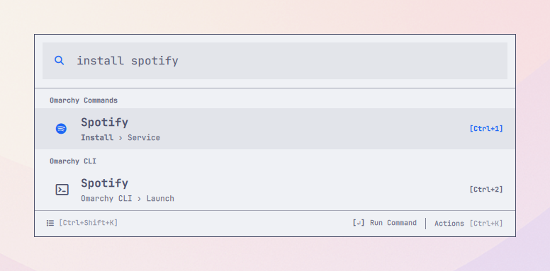
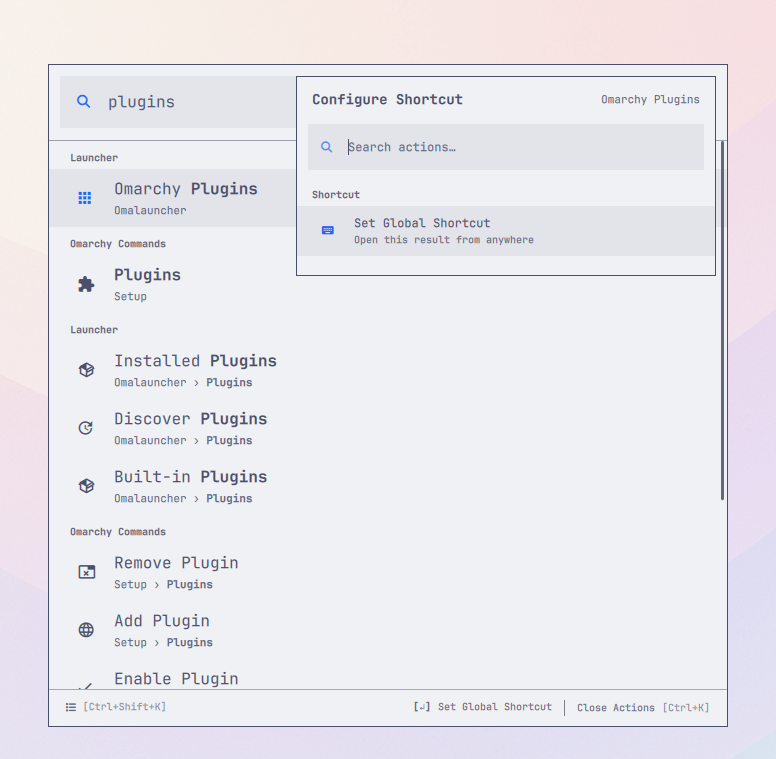

# Omalauncher

## Find every app and Omarchy feature from one place

Omalauncher turns Omarchy's apps, nested menus, shell features, and CLI catalog
into fast, keyboard-first search. Type what you mean—such as `clipboard`,
`toggle nightlight`, or `browser default`—without remembering where it lives.

**Built for Omarchy 4 · Current build: v0.10.0**

[Install](#install) · [See how it works](#how-it-works) ·
[View shortcuts](#keyboard-shortcuts)



_Open, search, and act without leaving the keyboard._

## Why Omalauncher?

Omarchy provides hundreds of useful actions, but finding one can mean
remembering a submenu, shortcut, panel, or terminal route. Omalauncher searches
applications, commands, and summonable shell features together.

| Type what you remember | Find what you need |
| --- | --- |
| `docker` | Docker app and Docker DB — Install › Development |
| `install spotify` | Spotify — Install › Service |
| `toggle nightlight` | Nightlight — Trigger › Toggle |
| `browser default` | Browser — Setup › Defaults |

Results still respect Omarchy's availability checks, so commands appear only
when they can be used on the current system.

## What you can do

- **Search everything together.** Find installed applications, Omarchy menu
  commands, live shell features, CLI commands, and your own menu additions from
  one search field.
- **Keep the context.** Breadcrumbs distinguish similar results and show where
  every command lives in Omarchy.
- **Make results yours.** Favorite and reorder important items, create your own
  search aliases, hide distractions, and recover hidden results at any time.
- **Act without breaking focus.** Press `Ctrl+K` or right-click a result to
  search its actions, open its parent menu, or manage personalization.
- **Open it your way.** Use the Omarchy bar icon or choose a global shortcut
  during the two-step welcome setup.
- **Get useful defaults.** An empty search shows favorites and recent items
  first, followed by browsable applications, menu commands, and shell features.
  The larger CLI catalog appears when you search, without cluttering that view.
- **Stay inside familiar Omarchy flows.** Menu actions return to Omarchy,
  shell features use the shell's own summon API, and CLI commands are passed as
  literal argument arrays.

## A closer look

### Applications and commands, side by side

The same query can find an installed application and a related Omarchy command
without mixing up what each result will do.



### Context for every command

Breadcrumbs make deeply nested actions understandable before you run them. For
example, `install spotify` finds the Spotify action under Install › Service.



### More actions when you need them

The Action Panel keeps the primary action obvious while putting navigation,
aliases, favorites, and ranking controls one shortcut away.



## More than app search

### Shell features and the complete CLI catalog

Search for **Clipboard** to open Omarchy's clipboard history directly. Other
enabled, summonable shell surfaces—such as Audio, Bluetooth, Display, Network,
Power, Calendar, Weather, Agents, and Tailscale—are discovered from the live
shell registry instead of being maintained as a second hard-coded menu.
Notification History and the coding-agent picker are included as searchable
first-class actions as well.

Omalauncher also indexes `omarchy commands --json`. A small reviewed set of
context-free commands can run directly; commands that need arguments,
privileges, or more context open their `--help` in a terminal. Exact menu and
shell duplicates appear only once. The CLI catalog, plugin registry, plugin
configuration, and menu sources refresh automatically when they change, and
the provider retry action reloads them on demand.

### Calculator

Enter an expression such as `= 12 * 8` or `= 10 km to mi`. The answer appears
as a result and `Enter` copies it. Calculator support uses the optional `qalc`
command from `libqalculate`; the rest of Omalauncher keeps working when it is
not installed.

### Scoped file search

Search for files inside only the folders you choose. Enable the provider in
`Omalauncher Settings`, add one or more folders, then open **Search Files** or
type a query such as `f report.pdf` from Root Search.

File search is off by default, never accepts `/` as a scope, and uses the
optional `fd` command. From a file's Action Panel you can open it, reveal its
folder, or copy its full path.

### Settings inside the launcher

Search for **Omalauncher Settings** to change the launcher shortcut, rerun
welcome setup, configure Compact Mode, numbered result shortcuts, calculator
and file search, folder scopes, and ignore patterns. Settings and
personalization resets require confirmation.

## Install

Omalauncher is tested with **Omarchy 4.0** and **Quickshell 0.3**.

### 1. Add the plugin

```bash
omarchy plugin add https://github.com/mirashif/omalauncher.git --enable --yes
```

### 2. Complete welcome setup

Click the Omalauncher search icon on the right side of the bar. Welcome setup
suggests `SUPER + SPACE`, lets you record another chord, checks current
Hyprland bindings, and asks explicitly before replacing a conflict. The final
step has you close and reopen Omalauncher with the shortcut so the setup is
verified.

The recommended choice replaces the stock Omarchy Menu shortcut atomically:
Omalauncher takes `SUPER + SPACE` and Omarchy Menu moves to `SUPER + R`. Setup
checks that both chords are safe before changing either one, so the stock menu
is never left without a shortcut. If you choose another available chord,
existing Omarchy shortcuts stay where they are.

Shortcut changes are written to Omalauncher's marked block in
`~/.config/hypr/bindings.lua`. The previous file is backed up, Hyprland is
reloaded and checked for configuration errors, and a failed change is rolled
back automatically.

After the recommended swap, Omarchy Menu remains available on `SUPER + R` and
the stock application launcher remains on `SUPER + ALT + SPACE`.

### 3. Start searching

Press your chosen shortcut, type an application or command, and press `Enter`. Use
`Ctrl+K` whenever you want to see more actions for the selected result.

## How it works

1. Open Omalauncher and start typing.
2. Applications, menu commands, live shell features, and CLI commands are
   searched together.
3. The closest textual match wins; recent use helps order equally strong
   matches.
4. Press `Enter` for the primary action, or `Ctrl+K` for everything else.

Static Omarchy submenus and installed applications open inside Omalauncher.
Summonable panels and overlays open through Omarchy Shell. Dynamic providers
that cannot be reproduced safely—currently Fonts—open in the stock Omarchy
menu instead.

## Keyboard shortcuts

These shortcuts cover the everyday search-and-run flow:

| Shortcut | What it does |
| --- | --- |
| `Enter` | Open or run the selected result |
| `Ctrl+K` | Open or close the selected result's Action Panel |
| `Ctrl+F` | Add or remove the selected favorite |
| `Ctrl+1`…`Ctrl+9`, `Ctrl+0` | Open results 1–10, including off-screen results |
| `Shift+Escape` | Return directly to Root Search |
| `Ctrl+W` | Close Omalauncher immediately |
| `Escape` | Close the current layer, clear search, go back, or close |

<details>
<summary>All keyboard shortcuts</summary>

| Shortcut | What it does |
| --- | --- |
| `Ctrl+Enter` | Open the selected static menu command's parent inside Omalauncher |
| `Ctrl+Shift+Up/Down` | Reorder the selected favorite |
| `Ctrl+Up/Down` | Jump between result or action sections |
| `Up/Down` | Move through results, wrapping at either end |
| `Ctrl+Shift+C` | Enable or disable Compact Mode |
| `Backspace` or `Left` | Leave a submenu when its search is empty |

Right-clicking a result opens the same Action Panel as `Ctrl+K`.

</details>

## Personal, local, and accessible

Favorites, aliases, hidden results, preferences, and usage history are stored
locally at:

```text
${XDG_STATE_HOME:-~/.local/state}/omalauncher/state.json
```

This state survives plugin updates and reinstalls. Calculator expressions and
file results are not added to usage history.

Search, results, actions, editing, settings, warnings, and retry controls expose
Qt accessibility information for assistive technology. Compact Mode can reduce
the empty launcher to a single search field and expands automatically when you
start interacting.

## Update

```bash
omarchy plugin update com.mirashif.omalauncher --yes
```

If a keep-loaded instance does not refresh after an update, restart the shell:

```bash
omarchy restart shell
```

<details>
<summary>Roll back to an earlier commit</summary>

```bash
plugin_dir="$HOME/.config/omarchy/plugins/com.mirashif.omalauncher"
git -C "$plugin_dir" log --oneline -10
git -C "$plugin_dir" checkout <commit>
omarchy restart shell
```

</details>

## Remove

Remove the launcher shortcut from Omalauncher Settings first, then remove the
plugin.

```bash
omarchy plugin disable com.mirashif.omalauncher
omarchy plugin remove com.mirashif.omalauncher
```

Personalization remains at the state path above so it is available after a
reinstall. Delete that directory separately only if you want a complete reset.
Omalauncher never modifies packaged files below `/usr/share/omarchy`.

## Troubleshooting

If the shortcut does nothing, confirm the binding exists and ask Hyprland to
report configuration errors:

```bash
rg -n 'SUPER.*(SPACE|R)|com.mirashif.omalauncher' ~/.config/hypr/bindings.lua
hyprctl reload
hyprctl configerrors
```

If a warning icon appears in Omalauncher, open it for provider-specific details.
Press `Enter` or `Ctrl+R` in that panel to reload applications, menus, shell
features, the CLI catalog, checks, and launcher state.

For a stale instance or an unexplained provider failure, restart the shell and
inspect its recent log:

```bash
omarchy restart shell
qs log -p "$OMARCHY_PATH/shell" -t 100 | rg -i 'omalauncher|warning|error'
```

<details>
<summary>Advanced health check</summary>

```bash
omarchy-shell shell call com.mirashif.omalauncher ping ''
omarchy-shell shell call com.mirashif.omalauncher stats ''
```

A malformed `~/.config/omarchy/extensions/omarchy-menu.jsonc` is reported in
the launcher and shell log while the last valid command index remains usable.
Commands whose availability checks are false are intentionally absent.

</details>

## Development

See [CONTRIBUTING.md](CONTRIBUTING.md) for local setup, validation, benchmarks,
and implementation notes. The longer-term direction and product boundaries are
documented in [PLAN.md](PLAN.md).

## Author and support

Created and maintained by [Mir Ashif](https://mirashif.com). Find the project on
[GitHub](https://github.com/mirashif/omalauncher), or report bugs and request
features through [GitHub Issues](https://github.com/mirashif/omalauncher/issues).

## License

Omalauncher is available under the [MIT License](LICENSE). It integrates with
the installed Omarchy shell and theme APIs but does not redistribute Omarchy's
packaged files.
