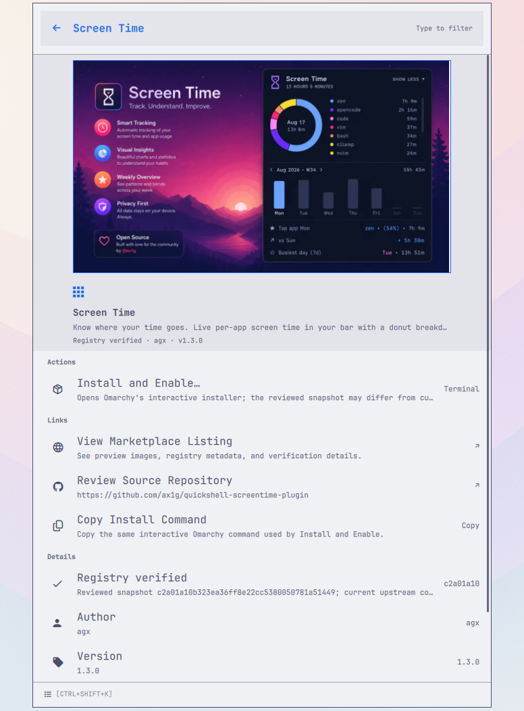
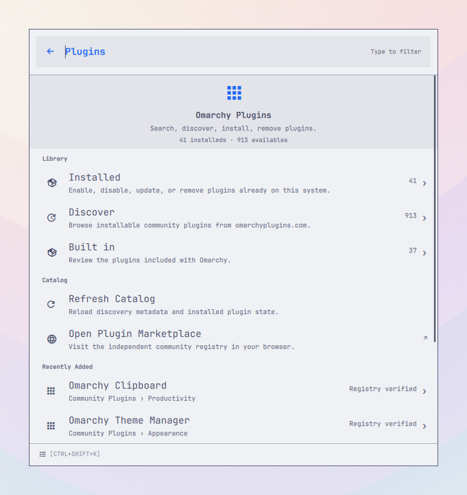
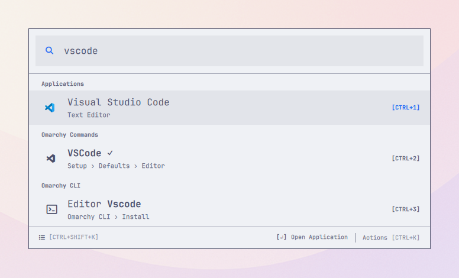
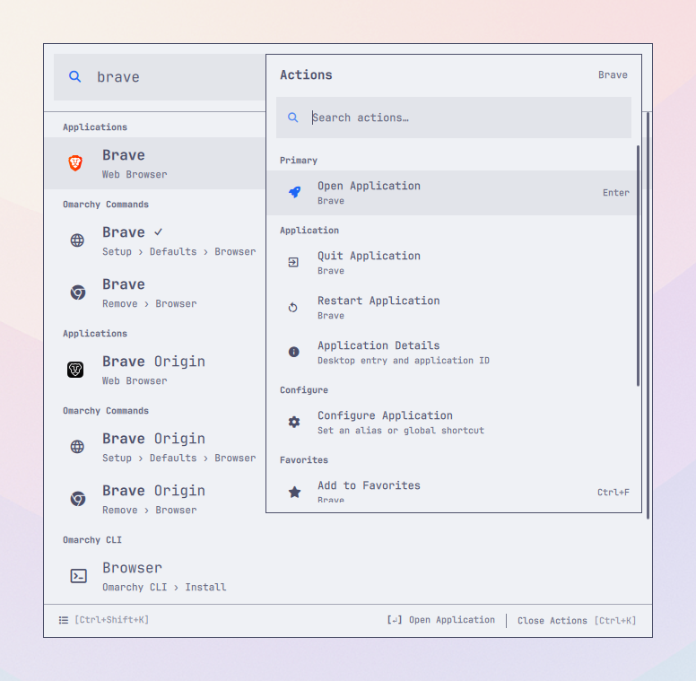
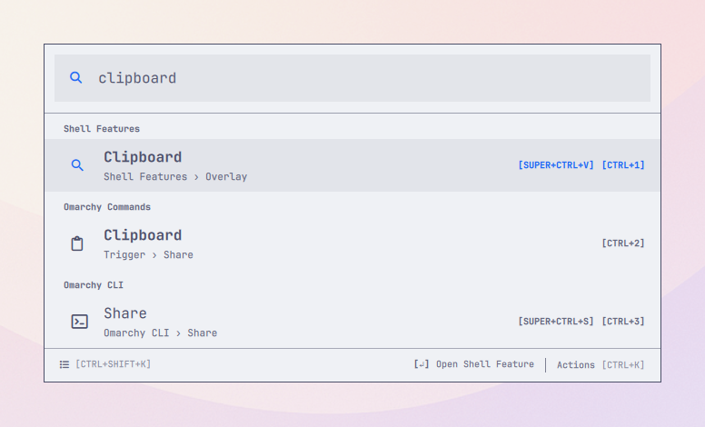
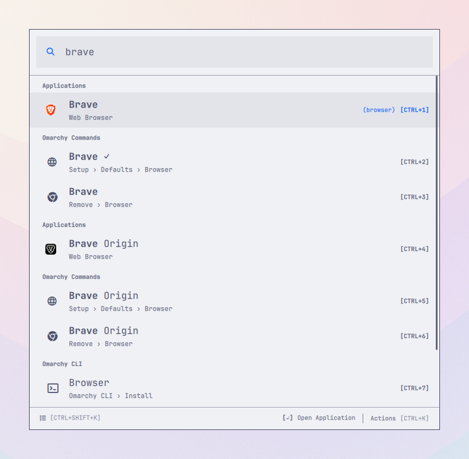
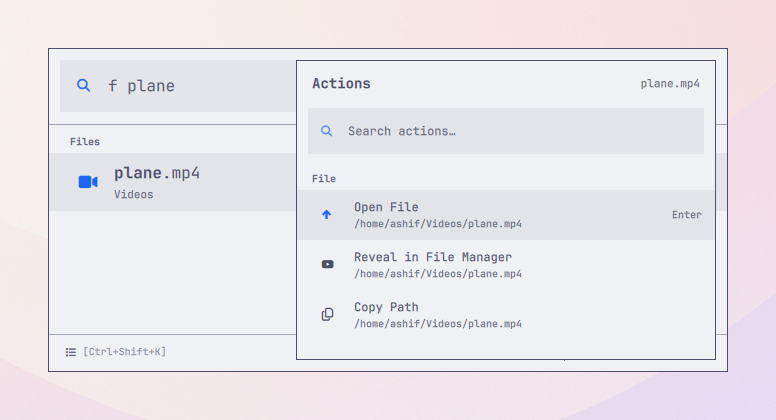
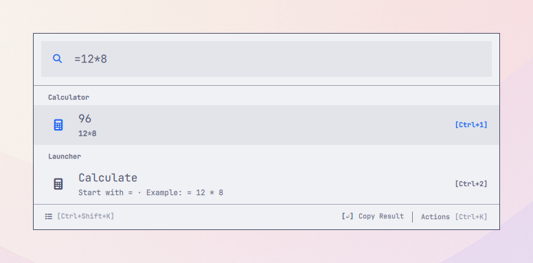
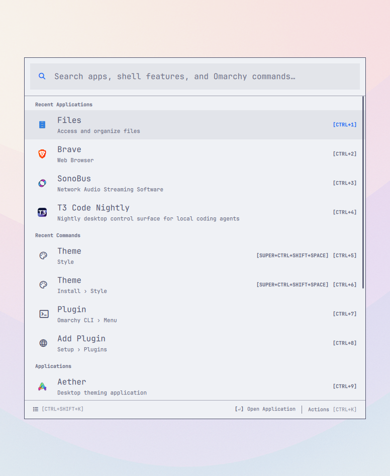

# OmaLauncher

## Keyboard-first command palette for Omarchy

Find applications, menus, shell features, CLI commands, and plugins using the
words you remember—such as `plugins`, `clipboard`, or `browser default`. Launch
apps, run actions, assign global shortcuts, and discover, install, or remove
plugins without memorizing where anything lives.

**Built for Omarchy 4 · Current release: v1.2.1**

[Install](#install) · [See how it works](#how-it-works) ·
[View shortcuts](#keyboard-shortcuts)


_Search, discover, install, remove plugins; assign global shortcuts; search
live Omarchy surfaces; calculate; work with files; and control applications
without leaving the launcher._

## Why OmaLauncher?

Omarchy provides hundreds of useful actions, but finding one can mean
remembering a submenu, shortcut, panel, or terminal route. OmaLauncher searches
applications, commands, and summonable shell features together.

| Type what you remember | Find what you need |
| --- | --- |
| `plugins` | Omarchy Plugins — search, discover, install, remove plugins |
| `docker` | Docker app and Docker DB — Install › Development |
| `install spotify` | Spotify — Install › Service |
| `toggle nightlight` | Nightlight — Trigger › Toggle |
| `browser default` | Browser — Setup › Defaults |

Results still respect Omarchy's availability checks, so commands appear only
when they can be used on the current system.

## What you can do

- **Omarchy Plugins — search, discover, install, remove plugins.** Type
  `plugin` or `plugins` to put the feature first, then inspect installed,
  built-in, and community plugins from the same keyboard-first interface.
- **Search everything together.** Find installed applications, Omarchy menu
  commands, live shell features, CLI commands, and your own menu additions from
  one search field.
- **Keep the context.** Breadcrumbs distinguish similar results and show where
  every command lives in Omarchy.
- **Make results yours.** Favorite and reorder important items, create your own
  search aliases, hide distractions, and recover hidden results at any time.
- **Make stable actions instant.** Assign, change, or remove global shortcuts
  for applications, shell features, Omarchy menu entries, safe direct CLI
  commands, and launcher or plugin navigation.
- **Act without breaking focus.** Press `CTRL+K` or right-click a result to
  search its actions, open its parent menu, or manage personalization.
- **See shortcuts before you act.** Results with an active Omarchy shortcut or
  an OmaLauncher-managed global shortcut show that chord in the list; numbered
  activation hints remain on rows without an assigned shortcut.
- **Open it your way.** Use the Omarchy bar icon or choose a global shortcut
  during welcome setup.
- **Get useful defaults.** An empty search shows favorites and recent items
  first, followed by browsable applications, menu commands, and shell features.
  The larger CLI catalog appears when you search, without cluttering that view.
- **Stay inside familiar Omarchy flows.** Menu actions return to Omarchy,
  shell features use the shell's own summon API, and CLI commands are passed as
  literal argument arrays.

## A closer look

### Omarchy Plugins — search, discover, install, remove plugins

Type `plugin` or `plugins` in Root Search and **Omarchy Plugins** stays ahead
of related stock menu commands, even when usage history would otherwise change
their order.

From **Discover**, open
[**Screen Time**](https://omarchyplugins.com/plugin.html?id=agx.screen-time) to
inspect its marketplace preview, install action, source repository, registry
verification, version, and author without leaving the launcher.



The catalog hub shows live installed, discoverable, and built-in totals. It
also surfaces recently added community plugins and keeps management actions
available when the remote registry is offline.



### Installed applications come first

In this live Omarchy session, searching `vscode` puts the installed application
first while keeping the related setup and CLI routes one shortcut away.



### Control running applications

Press `CTRL+K` to search an application's actions. Running applications expose
quit and restart controls, while supported desktop applications can be
uninstalled after confirmation.



### Search the live shell, menu, and CLI together

One query can find a summonable shell feature, its related menu route, and a
CLI command. Provider headings and breadcrumbs make the destination clear
before anything runs.



### Give any stable action a global shortcut

Open a result's Action Panel, choose **Configure**, then **Set Global
Shortcut**. The same editor works for applications, shell features, static
Omarchy menu entries, reviewed direct CLI commands, and launcher routes such as
Settings, Files, and plugin pages. Existing assignments can be changed or
removed from the same place.


OmaLauncher only owns the additional shortcuts it creates. Existing Omarchy
shortcuts remain inherited and read-only. Transient file and calculator
results, status rows, privileged or argument-taking CLI commands, and
destructive plugin lifecycle actions intentionally cannot own a shortcut.

### Search with your own language

Aliases stay visible as quiet parenthesized annotations, such as `(browser)`,
without competing with result titles or keyboard cues.



### Find local files and folders without searching everywhere

File search starts with your standard user folders and stays inside those plus
any folders you explicitly add. It skips hidden, dependency, cache, and build
trees by default. The Action Panel can open a selected file or folder, reveal
it in the file manager, or copy its full path.



### Calculate without opening another app

Type math such as `12 * 8` or a conversion such as `10 km to mi`. The built-in
answer appears above other matching results and can be copied immediately.



### Start with what matters to you

An empty search puts favorites first, followed by recently used applications
and commands. Number badges make the first ten results directly accessible
from the keyboard. When a result already has a global shortcut—such as
Clipboard's `SUPER+CTRL+V`—that assigned chord replaces its number badge.



## More than app search

### A plugin catalog designed for trust

The catalog is lazy-loaded from the independent
[Omarchy Plugins community registry](https://omarchyplugins.com/).
Installed plugin controls remain available if the registry is offline. The
catalog separates installed, discoverable, and built-in plugins; searches in
**Discover** cover the complete remote catalog even though the initial browse
view is deliberately bounded. **Installed Plugins**, **Discover Plugins**, and
**Built-in Plugins** are also first-class Root Search results.

When a marketplace listing provides a screenshot, its detail hero shows a
cached, aspect-preserving preview. OmaLauncher fetches that image only after a
detail route opens; a failed or missing preview falls back to the plugin icon.

Plugin details expose the source repository, author, version, license, and the
registry's verification state. “Registry verified” means that the registry
reviewed a recorded source snapshot—it is not a security audit or a guarantee
that the repository's current default branch is unchanged. Community plugins
run unsandboxed, so review the source before installing.

Install, update, and remove actions open Omarchy's interactive flow in a visible
terminal. OmaLauncher never adds `--yes` to those lifecycle commands. Enable
and disable use validated literal plugin IDs through Omarchy's own plugin CLI;
catalog-provided command strings are never executed.

### Shell features and the complete CLI catalog

Search for **Clipboard** to open Omarchy's clipboard history directly. Other
enabled, summonable shell surfaces—such as Audio, Bluetooth, Display, Network,
Power, Calendar, Weather, Agents, and Tailscale—are discovered from the live
shell registry instead of being maintained as a second hard-coded menu.
Notification History and the coding-agent picker are included as searchable
first-class actions as well.

OmaLauncher also indexes `omarchy commands --json`. A small reviewed set of
context-free commands can run directly; commands that need arguments,
privileges, or more context open their `--help` in a terminal. Exact menu and
shell duplicates appear only once. The CLI catalog, plugin registry, plugin
configuration, and menu sources refresh automatically when they change, and
the provider retry action reloads them on demand.

### Calculator

Enter an expression such as `12 * 8` or `10 km to mi`. The answer appears first
while other launcher matches remain below it, and `ENTER` copies the result.
The calculator is built in and supports arithmetic, common functions,
percentages, and common length, mass, time, temperature, volume, speed, area,
data-size, and angle conversions. A leading `=` remains accepted but is not
required.

### Scoped file search

Search for regular files and folders by opening **Search Files** or typing a
query such as `f report.pdf` from Root Search. File search is on by default and
starts with the standard folders that exist in your home directory, including
Documents, Downloads, Desktop, Projects, Code, Music, Pictures, and Videos.

Search never accepts `/` as a scope. Hidden paths plus common dependency,
cache, and build folders are pruned automatically; additional glob ignores and
scopes remain configurable. Results are capped, timed out, canonicalized, and
kept inside their configured scope. File search uses the standard system
`find` and `realpath` utilities already present in Omarchy.

### Settings inside the launcher

Search for **OmaLauncher Settings** to change the launcher shortcut, rerun
welcome setup, configure Compact Mode, numbered result shortcuts, calculator
and file search, and configure folder scopes and extra ignore patterns. Settings and
personalization resets require confirmation.

## Install

OmaLauncher is tested with **Omarchy 4.0** and **Quickshell 0.3**.

The required runtime is the standard Omarchy desktop stack: `omarchy`,
`omarchy-shell`, Quickshell, Hyprland (`hyprctl`), `xdg-open`,
`xdg-terminal-exec`, `wl-copy`, and standard shell/core utilities. A supported
Omarchy installation already provides these. Calculator and file search add no
feature-specific runtime packages.

### 1. Add the plugin

```bash
omarchy plugin add https://github.com/mirashif/omalauncher.git --enable --yes
```

### 2. Complete welcome setup

Click the OmaLauncher search icon on the right side of the bar. Welcome setup
suggests `SUPER+SPACE`, lets you record another chord, checks current
Hyprland bindings, and asks explicitly before replacing a conflict. It then
has you close and reopen OmaLauncher with the shortcut so the setup is verified.

The recommended choice replaces the stock Omarchy Menu shortcut atomically:
OmaLauncher takes `SUPER+SPACE` and Omarchy Menu moves to `SUPER+R`. Setup
checks that both chords are safe before changing either one, so the stock menu
is never left without a shortcut. If you choose another available chord,
existing Omarchy shortcuts stay where they are.

Shortcut changes are written to OmaLauncher's marked block in
`~/.config/hypr/bindings.lua`. The previous file is backed up, Hyprland is
reloaded and checked for configuration errors, and a failed change is rolled
back automatically.

After the recommended swap, Omarchy Menu remains available on `SUPER+R` and
the stock application launcher remains on `SUPER+ALT+SPACE`.

### 3. Start searching

Press your chosen shortcut, type an application or command, and press `ENTER`. Use
`CTRL+K` whenever you want to see more actions for the selected result.

## How it works

1. Open OmaLauncher and start typing.
2. Applications, menu commands, live shell features, and CLI commands are
   searched together.
3. The closest textual match wins; recent use helps order equally strong
   matches.
4. Press `ENTER` for the primary action, or `CTRL+K` for everything else.

Static Omarchy submenus and installed applications open inside OmaLauncher.
Summonable panels and overlays open through Omarchy Shell. Dynamic providers
that cannot be reproduced safely—currently Fonts—open in the stock Omarchy
menu instead.

## Keyboard shortcuts

These shortcuts cover the everyday search-and-run flow:

| Shortcut | What it does |
| --- | --- |
| `ENTER` | Open or run the selected result |
| `CTRL+K` | Open or close the selected result's Action Panel |
| `CTRL+SHIFT+K` | Open or close the OmaLauncher menu |
| `CTRL+,` | Open Settings |
| `CTRL+F` | Add or remove the selected favorite |
| `CTRL+1`…`CTRL+9`, `CTRL+0` | Open results 1–10, including off-screen results |
| `SHIFT+ESCAPE` | Return directly to Root Search |
| `CTRL+W` | Close OmaLauncher immediately |
| `ESCAPE` | Close the current layer, clear search, go back, or close |

<details>
<summary>All keyboard shortcuts</summary>

| Shortcut | What it does |
| --- | --- |
| `CTRL+O` | Run the selected result's primary action |
| `CTRL+SHIFT+O` | Reveal a selected file or application's desktop entry |
| `CTRL+C` | Copy the selected result's path, command, result, or app ID when search text is not selected |
| `CTRL+SHIFT+,` | Configure the selected result |
| `CTRL+SHIFT+D` | Hide or restore the selected result |
| `CTRL+SHIFT+/` | Open the User Guide |
| `CTRL+ENTER` | Open the selected static menu command's parent inside OmaLauncher |
| `CTRL+SHIFT+UP/DOWN` | Reorder the selected favorite |
| `CTRL+UP/DOWN` | Jump between result or action sections |
| `CTRL+N/P` | Move to the next or previous result/action |
| `ALT+UP/DOWN` | Move one page through results/actions |
| `UP/DOWN` | Move through results, wrapping at either end |
| `SHIFT+TAB` | Leave the current nested route |
| `CTRL+SHIFT+C` | Enable or disable Compact Mode |
| `BACKSPACE` or `LEFT` | Leave a submenu when its search is empty |

Right-clicking a result opens the same Action Panel as `CTRL+K`.
Choose **Configure** to set, change, or remove its OmaLauncher-managed global
shortcut when the result has a stable, repeatable action.

</details>

## Personal, local, and accessible

Favorites, aliases, hidden results, preferences, and usage history are stored
locally at:

```text
${XDG_STATE_HOME:-~/.local/state}/omalauncher/state.json
```

Managed global shortcuts live in one clearly marked block in
`~/.config/hypr/bindings.lua`. OmaLauncher backs up the file, reloads and
validates Hyprland, and rolls the change back if validation fails. Existing
v1.1 application shortcuts migrate without losing their assignments.

This state survives plugin updates and reinstalls. Calculator expressions and
file results are not added to usage history.

Search, results, actions, editing, settings, warnings, and retry controls expose
Qt accessibility information for assistive technology. Compact Mode can reduce
the empty launcher to a single search field and expands automatically when you
start interacting.

## Update

```bash
omarchy plugin update com.mirashif.omalauncher --yes
```

If a keep-loaded instance does not refresh after an update, restart the shell:

```bash
omarchy restart shell
```

<details>
<summary>Roll back to an earlier commit</summary>

```bash
plugin_dir="$HOME/.config/omarchy/plugins/com.mirashif.omalauncher"
git -C "$plugin_dir" log --oneline -10
git -C "$plugin_dir" checkout <commit>
omarchy restart shell
```

</details>

## Remove

Remove the launcher shortcut from OmaLauncher Settings first, then remove the
plugin.

```bash
omarchy plugin disable com.mirashif.omalauncher
omarchy plugin remove com.mirashif.omalauncher
```

Personalization remains at the state path above so it is available after a
reinstall. Delete that directory separately only if you want a complete reset.
OmaLauncher never modifies packaged files below `/usr/share/omarchy`.

## Troubleshooting

If the shortcut does nothing, confirm the binding exists and ask Hyprland to
report configuration errors:

```bash
rg -n 'SUPER.*(SPACE|R)|com.mirashif.omalauncher' ~/.config/hypr/bindings.lua
hyprctl reload
hyprctl configerrors
```

If a warning icon appears in OmaLauncher, open it for provider-specific details.
Press `ENTER` or `CTRL+R` in that panel to reload applications, menus, shell
features, the CLI catalog, checks, and launcher state.

For a stale instance or an unexplained provider failure, restart the shell and
inspect its recent log:

```bash
omarchy restart shell
qs log -p "$OMARCHY_PATH/shell" -t 100 | rg -i 'omalauncher|warning|error'
```

<details>
<summary>Advanced health check</summary>

```bash
omarchy-shell shell call com.mirashif.omalauncher ping ''
omarchy-shell shell call com.mirashif.omalauncher stats ''
```

A malformed `~/.config/omarchy/extensions/omarchy-menu.jsonc` is reported in
the launcher and shell log while the last valid command index remains usable.
Commands whose availability checks are false are intentionally absent.

</details>

## Development

See [CONTRIBUTING.md](CONTRIBUTING.md) for local setup, validation, benchmarks,
and implementation notes. The longer-term direction and product boundaries are
documented in [PLAN.md](PLAN.md).

## Author and support

Created and maintained by [Mir Ashif](https://mirashif.com). Find the project on
[GitHub](https://github.com/mirashif/omalauncher), or report bugs and request
features through [GitHub Issues](https://github.com/mirashif/omalauncher/issues).

## License

OmaLauncher is available under the [MIT License](LICENSE). It integrates with
the installed Omarchy shell and theme APIs but does not redistribute Omarchy's
packaged files.
